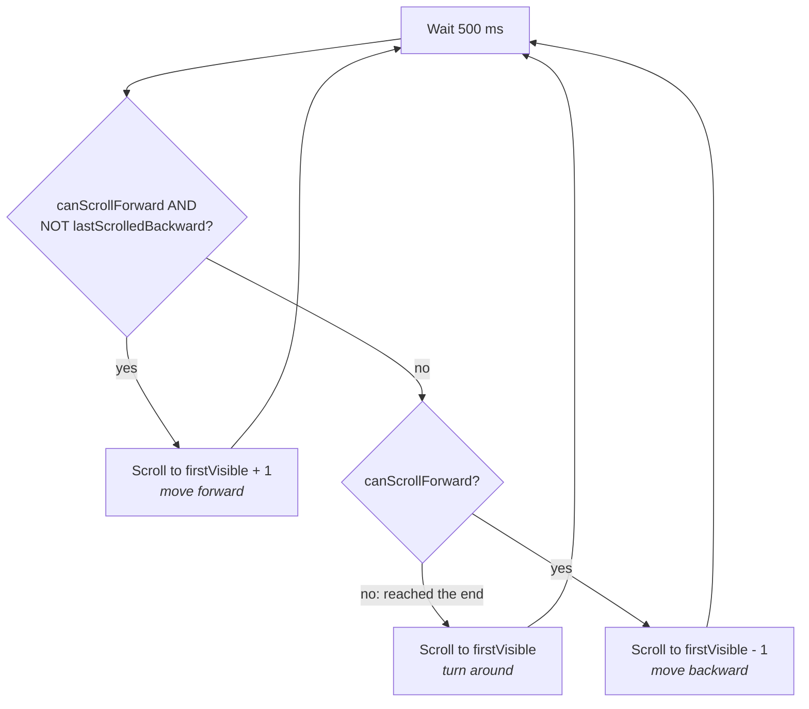

# Android Auto-Scroll Carousel

A small Jetpack Compose app that shows a horizontal carousel of color cards with an **Auto Scroll** toggle. When auto-scroll is on, the carousel moves one card at a time, then reverses at the end of the list and moves back toward the start.

## Features

- **Horizontal carousel:** a `LazyRow` of 350dp-wide Material 3 cards. Each card is filled with its color and labeled with the color's name and hex value.
- **Auto Scroll toggle:** a `Switch` with a tappable label. Turn it on and the carousel advances every 500 ms. Turn it off and it stops.
- **Ping-pong scrolling:** the carousel moves forward until it can't scroll any further, then changes direction and moves backward.
- **State that survives rotation:** the color list and the toggle state live in a `ViewModel` and are exposed as `StateFlow`s, so they persist through configuration changes.
- **Edge-to-edge UI:** content is laid out inside a `Scaffold` with system-bar insets applied.

## How it works

### Architecture

```
MainActivity
 └── MainScreen (Composable)
      ├── collects colorsState      ◄── MainViewModel (StateFlow<List<ColorInfo>>)
      ├── collects autoScrollState  ◄── MainViewModel (StateFlow<Boolean>)
      ├── LazyRow of color Cards
      └── Switch ── onAutoScrollClicked() ──► MainViewModel toggles state
```

| File | Responsibility |
| --- | --- |
| [`MainActivity.kt`](app/src/main/java/com/haidershah/myapplication/MainActivity.kt) | Hosts the Compose UI. `MainScreen` renders the carousel, the toggle and the auto-scroll loop. |
| [`MainViewModel.kt`](app/src/main/java/com/haidershah/myapplication/MainViewModel.kt) | Holds the list of colors and the auto-scroll flag as `StateFlow`s and flips the flag when the toggle is used. |
| [`model/ColorInfo.kt`](app/src/main/java/com/haidershah/myapplication/model/ColorInfo.kt) | Data class for one card: `colorName`, `colorHex` and a color resource ID. |
| [`ui/theme/`](app/src/main/java/com/haidershah/myapplication/ui/theme) | Material 3 theme, colors and typography. |

State flows one way. The ViewModel owns the state, the UI collects it with `collectAsStateWithLifecycle()`, and user actions go back to the ViewModel as events.

### The auto-scroll loop

Auto-scroll runs in a `LaunchedEffect` keyed on `isAutoScrollEnabled`. When the toggle flips, Compose cancels the running coroutine and starts a new one. Turning the toggle off therefore stops the loop right away, with no manual job handling.

Each tick waits 500 ms and then chooses a direction from the `LazyListState`:



`LazyListState.lastScrolledBackward` stores the direction, so the loop needs no extra state variable. The "turn around" step scrolls to the first visible card, which is partly off-screen at the end of the list. That scroll goes backward, so `lastScrolledBackward` flips to `true` and later ticks keep moving backward.

## Tech stack

- **Kotlin** 2.4 with **Jetpack Compose** (Compose BOM `2026.02.01`) and **Material 3**
- **AndroidX Lifecycle** 2.11: `ViewModel`, `collectAsStateWithLifecycle`
- **Kotlin Coroutines / Flow** for state and the scroll loop
- **Android Gradle Plugin** 9.4, `compileSdk`/`targetSdk` 37, `minSdk` 24, Java 11

## Getting started

### Requirements

- A recent version of Android Studio that supports AGP 9.4
- Android SDK 37
- An emulator or device running Android 7.0 (API 24) or later

### Run it

```bash
git clone https://github.com/haidershah/android-auto-scroll-carousel.git
cd android-auto-scroll-carousel
./gradlew installDebug
```

You can also open the project in Android Studio and run the `app` configuration.

## Known issues and next steps

- **The backward pass doesn't stop at the first card.** Once the carousel is back at index 0, the next tick calls `animateScrollToItem(-1)`. Compose rejects negative indices with an `IllegalArgumentException`. One fix: when `!canScrollBackward`, scroll forward again (or clamp the target with `coerceAtLeast(0)`).
- **Some labels don't match their colors.** "Pink" uses `purple_200`, and "Blue" uses `purple_700` but shows the teal hex `#FF018786`. Deriving the hex string from the color resource would keep labels and colors in sync.
- **Combine the screen state.** The ViewModel has a `// todo uistate` note. The two flows could become one `UiState` data class.
- **Hoist the scroll logic.** Moving the direction logic into a testable function, and making the interval and card width parameters, would make it easier to unit-test and reuse.
- **Handle user drags.** A drag during an auto-scroll animation interrupts that animation and competes with the loop. Auto-scroll could pause while the user is scrolling and resume afterwards.
