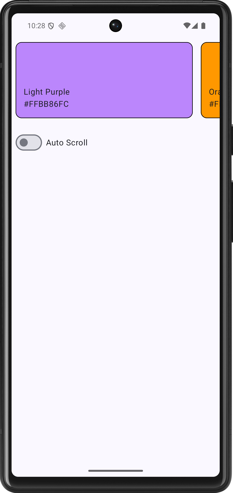

# Android Auto-Scroll Carousel

A Jetpack Compose app with a horizontal carousel of color cards and an **Auto Scroll** toggle. When it's on, the carousel moves one card every 500 ms, reverses at the end and moves back toward the start.



## How auto-scroll works

The loop runs in a `LaunchedEffect` keyed on `isAutoScrollEnabled`, so turning the toggle off cancels it. Each tick uses `LazyListState.canScrollForward` and `lastScrolledBackward` to decide whether to move forward, turn around at the end, or move backward.

## Tech stack

Kotlin, Jetpack Compose, Material 3, ViewModel, Coroutines/Flow. `minSdk` 24, `targetSdk` 37.

## Run it

```bash
./gradlew installDebug
```

Or open the project in Android Studio and run the `app` configuration.

## Future improvements

- Move the scroll direction logic into a testable function, and make the interval and card width parameters.
- Pause auto-scroll while the user is dragging the carousel.
